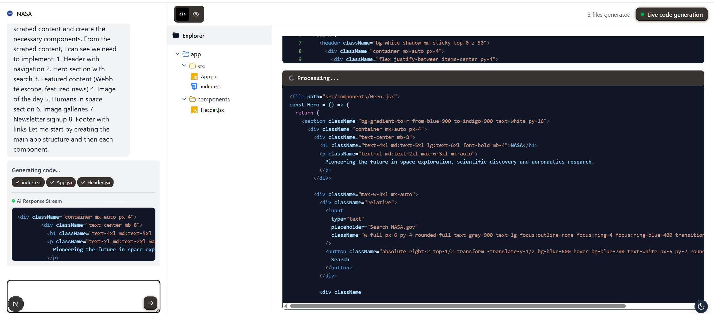

# openWebDev

[](https://github.com/mendableai/openWebDev/actions)
[](https://github.com/mendableai/openWebDev/releases)
[](LICENSE)

Chat with AI to build React apps instantly. An example app made by the [Firecrawl](https://firecrawl.dev/?ref=openwebdev-github) team. For a complete cloud solution, check out [Lovable.dev ❤️](https://lovable.dev/).



## Project Overview

openWebDev is an AI-powered web development tool that enables developers to rapidly prototype and build React applications, combining AI code generation with sandboxed execution environments. With openWebDev, you can describe your application requirements in natural language and instantly generate a fully functional React application with modern UI components, complete with real-time preview capabilities.

The platform leverages advanced AI models to understand your requirements and automatically generates clean, modern React code that follows best practices. Whether you're building a simple landing page or a complex web application, openWebDev streamlines the development process by eliminating the need for manual coding while maintaining complete control over the generated code.

## Key Features

openWebDev provides a comprehensive set of features designed to accelerate web development:

* **AI-Powered Code Generation**: Automatically generate React components and applications from natural language descriptions using state-of-the-art AI models
* **Sandboxed Execution**: Secure isolated environments for testing and previewing generated code without affecting your local system
* **Real-Time Preview**: Instantly see changes to your application as you develop with live preview capabilities
* **Multi-AI Model Support**: Choose from various AI providers including OpenAI, Anthropic, Google, and Groq for optimal results
* **Package Auto-Detection**: Automatically identifies and installs required npm packages based on generated code imports
* **Edit-In-Place Functionality**: Modify existing components and features with precise surgical edits
* **Website Cloning**: Recreate existing websites by simply providing a URL, with intelligent scraping and recreation
* **Theme Support**: Switch between light and dark themes with a single click
* **Downloadable Applications**: Export your generated applications as complete Vite projects ready for deployment
* **Context-Aware Development**: Maintains conversation history and project context for intelligent code modifications

## Architecture Overview

openWebDev follows a modern, scalable architecture designed for performance and extensibility:

* **Frontend**: Built with Next.js 15 and Tailwind CSS, providing a responsive and interactive user interface with dark mode support
* **Backend API Routes**: RESTful API endpoints handling AI interactions, sandbox management, and file operations
* **E2B Sandbox System**: Isolated execution environments for secure code testing and preview using E2B's code interpreter technology
* **AI Integration**: Multi-provider support through Vercel AI SDK, enabling access to various state-of-the-art models
* **File Management System**: Intelligent file parsing and component analysis for context-aware editing
* **Code Parsing Capabilities**: Advanced parsing for JavaScript/JSX files to understand imports, exports, and component relationships

## Getting Started

### Prerequisites

Before you begin, ensure you have the following installed:
- Node.js (version 18 or higher)
- npm or pnpm package manager
- Git for version control

### Setup

1. **Clone & Install**
```bash
git clone https://github.com/mendableai/openWebDev.git
cd openWebDev
npm install
```

2. **Add `.env.local`**
```env
# Required
E2B_API_KEY=your_e2b_api_key  # Get from https://e2b.dev (Sandboxes)
FIRECRAWL_API_KEY=your_firecrawl_api_key  # Get from https://firecrawl.dev (Web scraping)

# Optional (need at least one AI provider)
ANTHROPIC_API_KEY=your_anthropic_api_key  # Get from https://console.anthropic.com
OPENAI_API_KEY=your_openai_api_key  # Get from https://platform.openai.com (GPT-5)
GEMINI_API_KEY=your_gemini_api_key  # Get from https://aistudio.google.com/app/apikey
GROQ_API_KEY=your_groq_api_key  # Get from https://console.groq.com (Fast inference - Kimi K2 recommended)
```

3. **Run**
```bash
npm run dev
```

Open [http://localhost:3000](http://localhost:3000)

### Usage Workflow

1. **Create a New Application**: Start by describing your application in the chat interface. The AI will generate the complete React application structure.
2. **Preview Your App**: View your generated application in real-time using the integrated sandbox preview.
3. **Modify and Iterate**: Use natural language to make changes, add features, or fix issues with the edit-in-place functionality.
4. **Download and Deploy**: Export your complete application as a Vite project for local development or deployment.

## Contributing

We welcome contributions from the community! Please see our [Contributing Guide](CONTRIBUTING.md) for details on how to get started.

* **Reporting Issues**: Check existing issues first, then create a new issue with a clear description and steps to reproduce
* **Submitting Pull Requests**: Fork the repository, create a feature branch, implement your changes, and submit a PR
* **Development Setup**: Follow the setup instructions in the contributing guide for local development

## Documentation

Comprehensive documentation is available to help you get the most out of openWebDev:

* [Installation Guide](docs/INSTALLATION.md) - Detailed setup instructions and system requirements
* [Usage Documentation](docs/USAGE.md) - Comprehensive guide to using all features effectively
* [FAQ](docs/FAQ.md) - Answers to common questions and troubleshooting tips
* [Troubleshooting Guide](TROUBLESHOOTING.md) - Solutions to common issues and error messages
* [Package Detection Guide](docs/PACKAGE_DETECTION_GUIDE.md) - Information on how automatic package detection works

## Troubleshooting

If you encounter issues with openWebDev, check our [Troubleshooting Guide](TROUBLESHOOTING.md) for solutions to common problems:

* **Sandbox Creation Failures**: Verify E2B API key and network connectivity
* **Package Installation Problems**: Check npm configuration and package.json dependencies
* **AI Model Connection Issues**: Confirm API keys for selected AI providers are valid and have sufficient credits

For additional help, please open an issue on GitHub with detailed information about your problem.

## License

MIT
